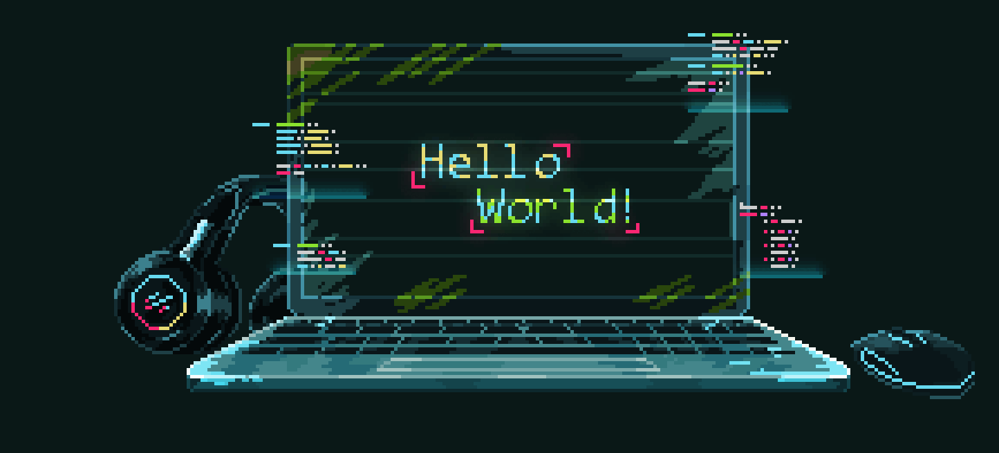

## Добро Пожаловать На Мой Github 

 

Здравствуйте! Меня зовут Владислав Бойко, и я разработчик. Моя профессиональная практика основана на постоянном стремлении к самосовершенствованию и новым вызовам в сфере IT технологий.
Мои интересы охватывают разнообразные области. Я активно участвую в хакатонах, что помогает мне не только тестировать свои навыки в условиях ограниченного времени, но и обмениваться опытом с другими разработчиками. Это позволяет мне оставаться на передовой инноваций и постоянно развивать свои знания и компетенции.

Я горжусь тем, что являюсь выпускником Югорского физико-математического лицея, одной из ведущих школ России, где получил прочную основу для дальнейшего обучения и профессионального роста. Это образование сыграло ключевую роль в формировании моего интеллектуального подхода к решению задач и научило меня стремиться к высоким стандартам в работе.

В настоящее время я обучаюсь в Казанском Федеральном Университете, который славится высоким уровнем обучения и научными традициями. Это учебное заведение открывает передо мной новые возможности и способствует углублению моих знаний, позволяя применять мои знания на практике.

Я искренне благодарю вас за интерес к моему профилю. Я открыт для сотрудничества и обмена идеями, и с нетерпением жду возможности совместной работы над интересными и амбициозными проектами.

### Навыки:

 
 

--------------------

### Контакты для связи:

    

  
--------------------
<!--
**Vladislav-Boiko-2005/Vladislav-Boiko-2005** is a ✨ _special_ ✨ repository because its `README.md` (this file) appears on your GitHub profile.

